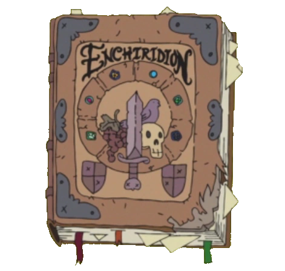

# UX and Web Design

 

  

 

 
 

</img>

## here you'll find...
 
 
 
 
visitors
 bio blurb
 how i code
 what i code
 ring me up

 

 
 

 

 
 
 
<h2>sign my guestbook?</h2>
 
<!-- Guestbook -->
| Name | Date | Message |
|---|---|---|

<!-- /Guestbook -->
<!-- Still figuring this one out -->

 

 

 

</img>

 
 
<h3>hey, that's me!</3>
 
 
<h4>
primarily a graphic designer, but i also dabble in web. started with some highschool
 classes and fell in love with javascript. couldn't tell you why. considered a CS degree but ended up in design.
 
special interest in UX and UI, some interest in front end web. experience with HTML, CSS,
 Lua, Javascript, and still expanding my toolbelt.
</h4>

 
 
 
 
 

 

 

 

</img>

 

 
 

 
<h4 align="center">thanks for visiting! here's where you can ring me up for commissions, collabs, job opportunities, or a nice chat</h4>
 

 
 
. . . .. . . .

 

